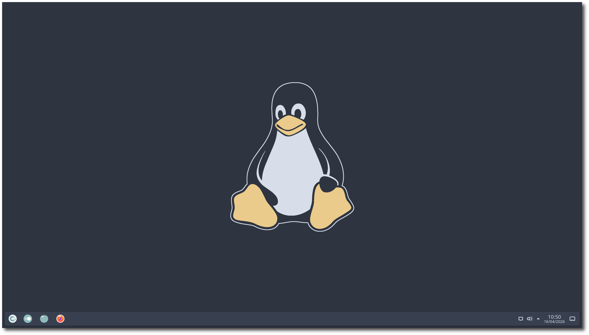
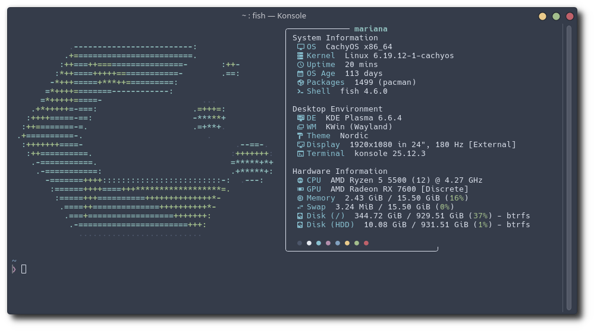

# KDE Dotfiles
A minimal configuration for KDE desktops using the Nord theme

## Preview



## Details
* **Operational System:** CachyOS
* **Shell:** fish
* **Desktop Environment:** KDE Plasma
* **Window Manager:** Kwin
* **Terminal:** Konsole
* **Fastfetch:** [Fastfetch Config](https://github.com/dacrab/fastfetch-config) 
* **Color Scheme:** [Nordic](https://store.kde.org/p/1326271/)
* **Plasma Theme:** [Polar Gleam](https://store.kde.org/p/2321371)
* **Plasma Window Decorations:** [Nordic](https://store.kde.org/p/1326274/)
* **Icons:** [Tela Circle Dark](https://store.kde.org/p/1359276/)
* **Cursors:** [Capitaine Cursors (Nord)](https://store.kde.org/p/1818760)
* **Firefox Theme:** [Nord](https://addons.mozilla.org/pt-BR/firefox/addon/nord123/)
* **VS Code Theme:** [Nord Aurora](https://marketplace.visualstudio.com/items?itemName=Avetis.nord-palette)

## Installation
Run the installer from the repository root:

```bash
chmod +x install.sh
./install.sh
```

By default, the script copies the files into your home directory and replaces existing targets directly

Optional step:

```bash
./install.sh --apply-theme
```

`--apply-theme` automatically applies the KDE color scheme, Plasma theme, window decoration, icon theme, cursor theme, Konsole default profile, desktop wallpaper, and lockscreen wallpaper for the current logged-in user
